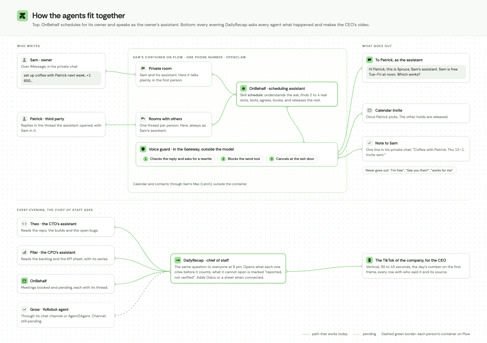

# OnBehalf

**A scheduling assistant you text. It speaks for you, never as you.**

You tell it "set up lunch with Patrick next week". It finds real slots on your calendar,
texts Patrick, agrees a time and books it. To Patrick it writes the way a good human assistant
would: *"Hi Patrick, this is Spruce, Sam's assistant. Sam is free Tue–Fri at noon. Which works
best?"*, never *"I'm free for lunch!"*.

That last part is the whole project. Assistants built on a model write in their owner's voice
sooner or later, and a prompt rule does not stop it: it holds most of the time, and a text to
an investor cannot be "most of the time". So OnBehalf enforces it in the Gateway, outside the
model.

## The voice guard

[`plugin/voice-guard`](plugin/voice-guard) is an OpenClaw plugin with three checks. None of
them depends on the model obeying:

| When | What it does |
|---|---|
| The model is about to finish a reply in a room with someone other than the owner | If the reply sounds like the owner ("I'm free", "See you then!", "works for me", "my calendar"), OpenClaw sends it back for one more pass with the exact phrase and how to fix it. |
| The model calls `message` or `plow_start_thread` | An owner-voice text to someone else is blocked, and the model gets the reason. |
| Any message is about to leave for a room with someone else in it | The last door: if it still carries the owner's voice, it is not delivered. If the guard cannot tell whose room it is, it assumes someone else's. |

The owner's private chat is untouched: there the assistant talks to its owner normally.

A fourth check keeps dates honest: a weekday that does not match its date ("Monday, Oct 6" when
Oct 6 is a Tuesday) is sent back for a rewrite in every room, and the plugin puts the owner's
name, time zone, today's date and the next two weeks with their weekdays at the top of every turn,
so the model never has to compute a weekday.

Verified on OpenClaw 2026.9.6: told to send *"Hey Patrick! I am free for lunch any day next
week… See you then!"* word for word in a group thread, the agent delivered *"Hi Patrick, this
is Spruce, Sam's assistant. Sam is free for lunch any day next week…"*. The same line in the
owner's private chat went through unchanged. The rules are in
[`voice.js`](plugin/voice-guard/voice.js). [`test/corpus.mjs`](test/corpus.mjs) measures them on 60
real lines (37 owner-voice lines stopped, 23 assistant lines passed, no false alarms), and
[`test/scenarios.mjs`](test/scenarios.mjs) runs 13 conversations against the real model: in 25
turns the guard never had to step in, because the identity held on its own; it is the net.

## Install

**One text, nothing to install:** send `Set this up for me: aiworthusing.com/agent-index/onbehalf`
by iMessage to +1 (628) 246-3032. Your assistant texts you back from its own number; text it
from the same iPhone. With Plow Latch on your Mac it finds your name, calendars and time zone
itself and asks only the name it signs with; without it, it asks for those and a calendar link.
It texts people directly: say "show me first" if you want to approve a first message.

**Your own OpenClaw Gateway:** copy `plugin/voice-guard` into your OpenClaw's
`dist/extensions/` (or install it with `openclaw plugins install --link ./plugin/voice-guard`
and set `plugins.entries.voice-guard.hooks.allowConversationAccess: true`), put `AGENTS.md`
and `skills/` in the agent's workspace, and restart the Gateway.

## Your Google calendar, without a Mac

In the first conversation the assistant asks for the calendar's private read-only address
(Google Calendar › Settings › your calendar › Integrate calendar › "Secret address in iCal
format"). [`bin/freebusy.mjs`](bin/freebusy.mjs) reads it and returns only free slots inside the
owner's hours, already labelled with weekday and date; busy blocks are counted, never described,
so nothing about the owner's day reaches the model. Recurring events, exceptions, all-day,
cancelled and "free" events and time zones are handled; [`test/freebusy.test.mjs`](test/freebusy.test.mjs)
pins them. With Plow's Latch app on the owner's Mac, it can use Google through the Mac instead.

## Invites without a connected Mac

With the owner's Mac connected through Latch, OnBehalf books on the owner's calendar. Without it,
[`bin/invite.mjs`](bin/invite.mjs) writes a standard `.ics` invite and the assistant sends it in
the thread: both people tap it to add the meeting. The script resolves the time zone, the UTC
conversion and the weekday, so the model never computes a time; the recap copies the script's
wording. [`test/invite.test.mjs`](test/invite.test.mjs) pins the conversions, daylight saving
included.

## Works with DailyRecap

[DailyRecap](https://github.com/rodrigoarias12/dailyrecap), the startup's chief of staff, asks
every agent on the team what happened each evening. OnBehalf answers with the meetings it
booked, the ones pending, and anything the guard made it rewrite, each with its thread.

## License

MIT.

## Releasing

An image reaches the one-click pin only through `node release/promote.mjs <commit>`, which refuses
unless, for that exact commit, three GitHub workflows passed:

- **test**: every deterministic test, including `test/regressions.json`, the real incidents (Sam's
  own install, a red-team run) replayed against the Gateway hooks and the scripts;
- **eval**: the voice guard against Plow's model on lines written by an agent that never saw the
  code (`test/voice-corpus.json`, heldout2), at least 55/60 owner lines stopped and 59/60 assistant
  lines passed. Needs the repository secret `PLOW_AGENT_TOKEN`;
- **image**: the build, whose log names the digest that gets promoted.

A new incident goes into `test/regressions.json` before its fix.
